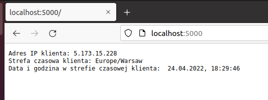
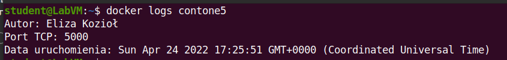
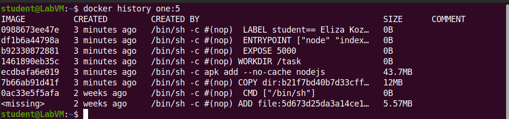
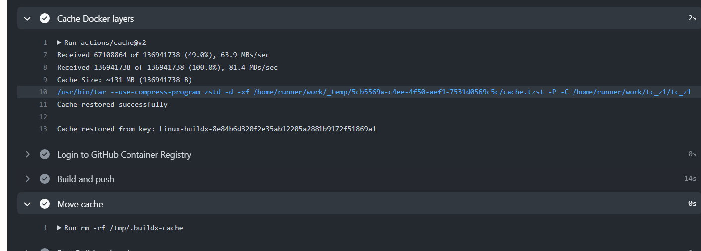

<h1>Zadanie 1 z Technologii Chmurowych - Eliza Kozioł<h1>

<h2>Część podstawowa:<h2>

Zad 1. 

Aplikacja napisana w szkielecie Express.js znajduje się w katalogu "zadanie1". Wykorzystywany port to 5000.

Zad 2.

Plik Dockerfile wraz z komentarzami umieszczony powyżej w obecnym repozytorium. 

Zad 3.

a. zbudowanie obrazu kontenera
	docker build -t one:5 .
b. uruchomienie kontenera na podstawie zbudowaego obrazu
	docker --run --name contone5 -p 5000:5000 one:5
c. sprawdzenie logów
	docker logs contone5
d. sprawdzenie warstw obrazu
	docker history one:5

Zad 4.

Użyte instrukcje:
	sudo apt-get install -y qemu-user-static
	docker buildx create --name taskbuilder
	docker buildx use taskbuilder
	docker buildx inspect --bootstrap
	docker buildx build -t ek00/zadanie1 --platform linux/arm/v7,linux/arm64/v8,linux/amd64 --push .
	
DockerHub: <a href="https://hub.docker.com/repository/docker/ek00/zadanie1">

<h2>Dodatek 1:<h2>	

WORKFLOW:

Wybrany typ maszyny: ubuntu-latest
"checkout" - jest to sprawdzenie, czy repozytorium jest dostępne dla workflow
"docker/setup-qemu-action@v1" - instalacja qemu do wielu architektur
"docker/setup-buildx-action@v1" - stworzenie i skonfigurowanie buildx'a potrzebnego do wielu architektur
"actions/cache@v2" - umożliwia cache'owanie zależności, eksport cache'a
"docker/login-action@v1" - logowanie do GitHub registry
"docker/build-push-action@v2" - umożliwia zbudowanie i wypchnięcie obrazu za pomocą buildx'a
"Move cache" - ustawienie eksportu cache'a i nadpisywanie starego nowym

